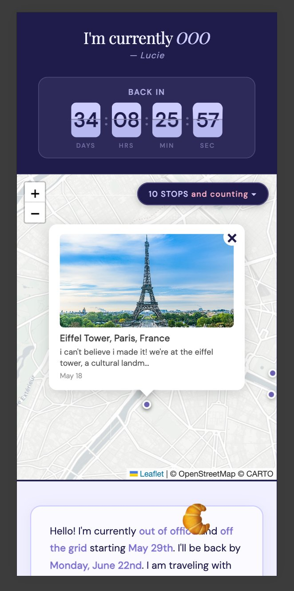
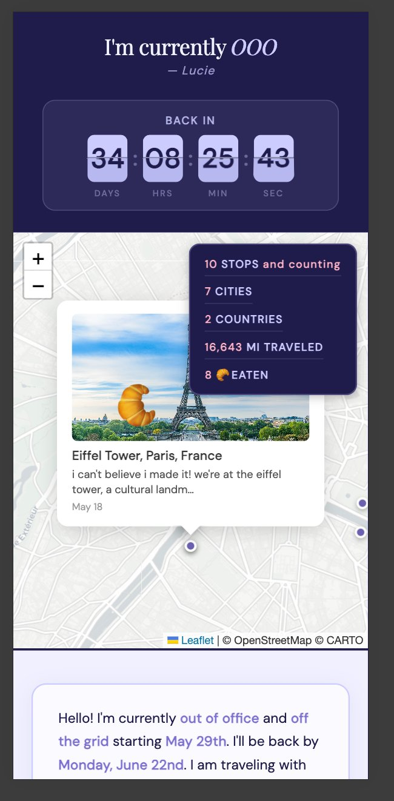
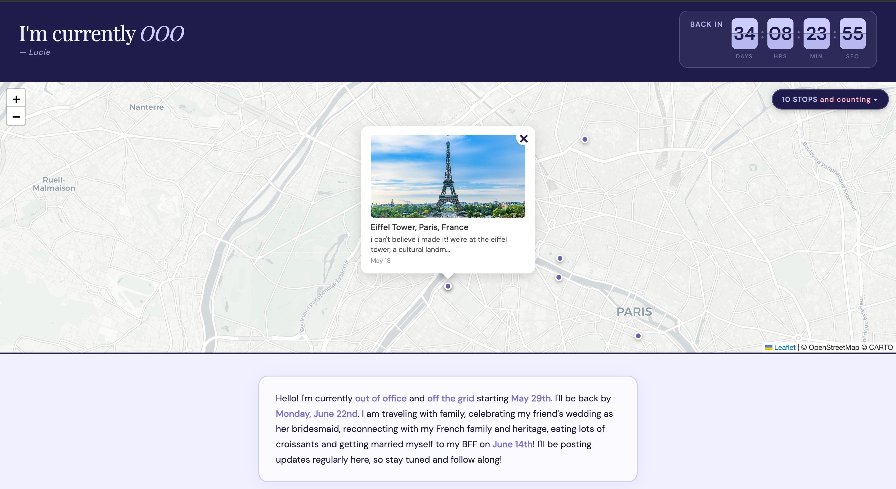
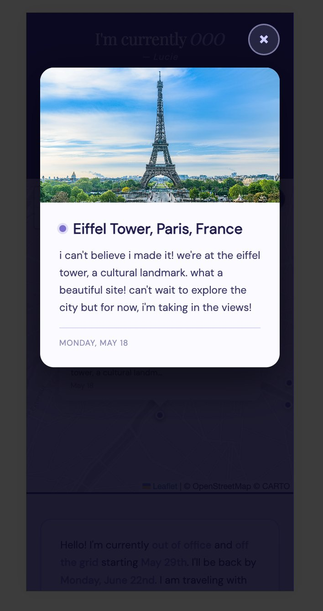
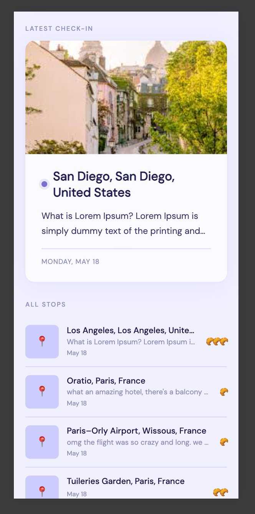
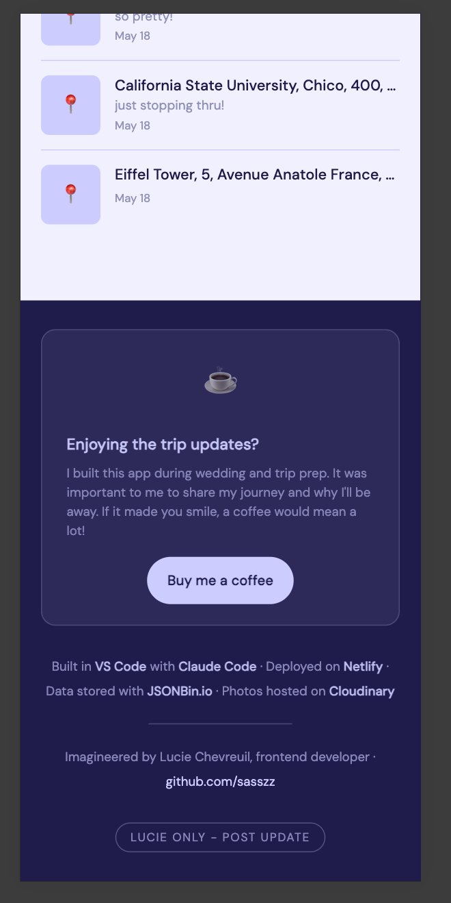
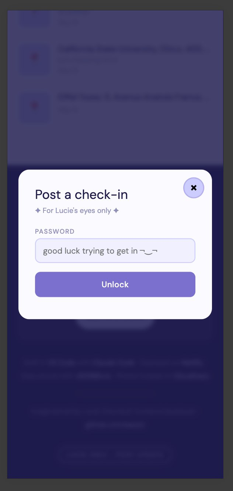
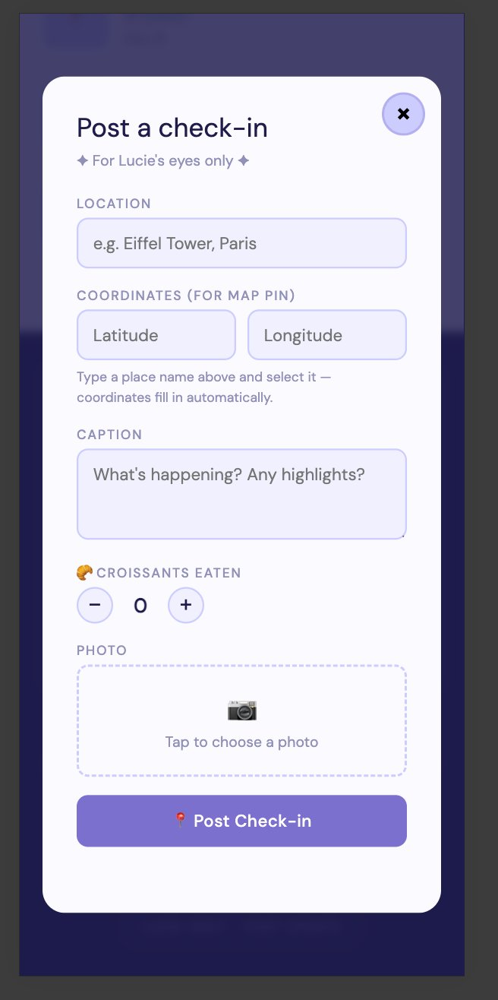

# 🥐 Lucie is OOO — Paris Trip 2026

## Inspiration

I was inspired to build this app while drafting an OOO for my Outlook inbox at my IT job. I felt that the standard OOO reply was dismissive and repetitive.

Rather than a static "I'm away, good luck," this app turns every OOO reply into an exciting travel journal. Colleagues can see what I'm up to, and it turns my absence from a moment of denial to a moment of connection. Also, since I'll be posting regular updates, if they inevitably get another OOO reply from me, there will be something new to check out!


## Summary

A personal travel journal where I post geo-tagged check-ins with photos with captions on an interactive map.

**Live site:** [ooo-paristrip2026.netlify.app](https://ooo-paristrip2026.netlify.app/)

---

## Screenshots

| Header & Map | Stats Badge | Desktop |
|---|---|---|
|  |  |  |

| Check-in Lightbox | Feed | Footer & Admin |
|---|---|---|
|  |  |  |

| Admin Login | Admin Post |
|---|---|
|  |  |

---

## Features

**For visitors:** flip-clock countdown · interactive map with pin popups · expandable stats (stops, cities, miles, croissants) · latest check-in card · full scrollable feed · photo lightbox · raining croissants animation · interactive croissant · scroll-to-content button (mobile) · custom favicon · **day/night mode** which change based on Lucie's local time

**For Lucie:** password-protected admin panel · location autocomplete with auto lat/lng · photo upload to Cloudinary · croissant stepper · saves to JSONBin.io instantly

---

## Technical Highlights

**Data persistence (JSONBin.io)** — Needed a way to store and retrieve check-in data without spinning up a database. JSONBin.io offered a free REST-based JSON store that fit the scale of a personal project.

**Image hosting (Cloudinary)** — JSONBin.io has a 100MB storage cap, so images couldn't be stored there. Cloudinary handles upload, storage, and CDN delivery separately.

**Serverless functions (Netlify Functions)** — API keys can't live in client-side JavaScript without being exposed to anyone who opens DevTools. Netlify Functions act as a secure proxy so secrets never reach the browser.

**CI/CD (GitHub + Netlify)** — Connecting the repo to Netlify meant every push to `main` deployed automatically, with traffic monitoring via the analytics dashboard.

**Map (Leaflet.js)** — Needed an interactive map without Google Maps' API costs or billing setup. Leaflet is open-source and free

**Mobile-first design** — Most visitors would be checking the site on their phones

**AI-assisted development (Claude Code)** — Building a full-featured app solo during wedding and trip prep left little room for slow iteration. Used Claude Code as an AI pair programmer to move faster.

**Local development (Netlify CLI)** — Serverless functions don't run when you just open `index.html` in a browser. `netlify dev` replicates the full production environment locally.

**Security** — Admin password and all API keys stored as environment variables, never exposed in client code.

---

## Security in Mind

Sharing a live travel journal publicly comes with real privacy concerns. A few intentional design decisions were made to address that:

**Manual location entry** — Location is typed by hand, not pulled from GPS.

**No photo EXIF data** — Cloudinary strips EXIF metadata whenever a transformation is applied. Since uploaded photos are resized for display, location metadata is removed in the process.

**Date only, no timestamp** — Check-ins display the date but not the time of day.

---

## Tech Stack

Vanilla HTML/CSS/JS · [Leaflet.js](https://leafletjs.com/) · [JSONBin.io](https://jsonbin.io) · [Cloudinary](https://cloudinary.com) · [Netlify Functions](https://docs.netlify.com/functions/overview/) · Netlify

---

## Local Development

```bash
git clone https://github.com/sasszz/ooo-paris-2026.git
cd ooo-paris-2026
npm install -g netlify-cli
netlify dev  # runs at http://localhost:8888
```

Set these env vars in `.env` or the Netlify dashboard:

- `JSONBIN_BIN_ID`
- `JSONBIN_API_KEY`
- `CLOUDINARY_CLOUD_NAME`
- `CLOUDINARY_UPLOAD_PRESET`
- `ADMIN_PASSWORD`

---

## Authors

**Lucie Chevreuil** — [github.com/sasszz](https://github.com/sasszz)

**Claude Code** -[https://claude.ai/code](https://claude.ai/code)

---

## Buy Me a Coffee

If this app made you smile, consider supporting the developer and her croissant fund.

[buymeacoffee.com/lucieshevroy](https://buymeacoffee.com/lucieshevroy)
